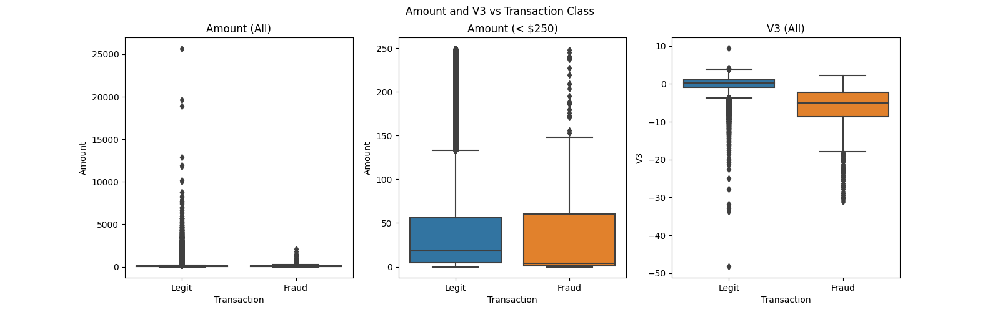
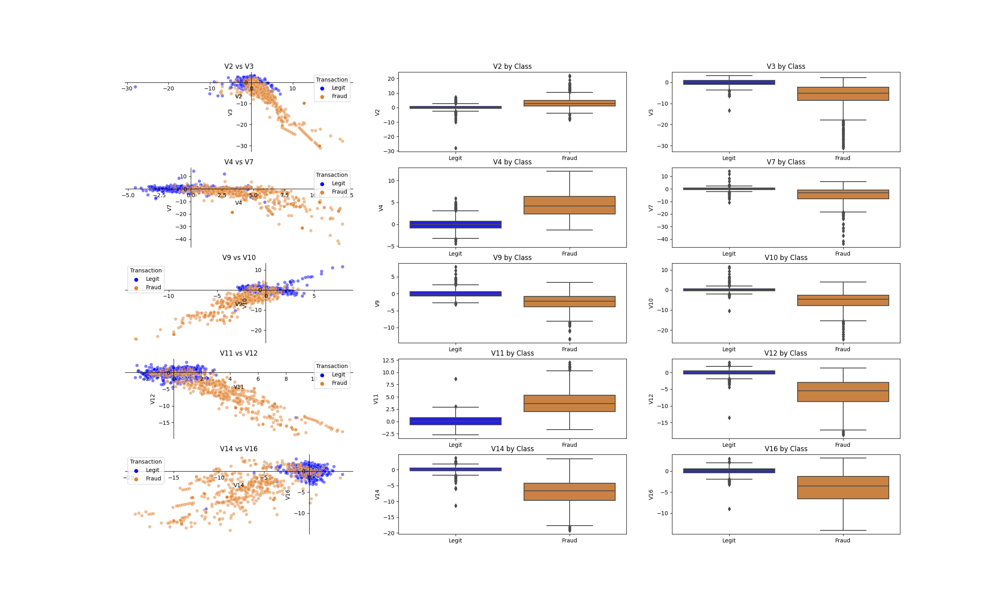
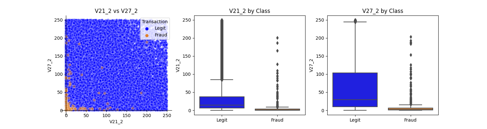
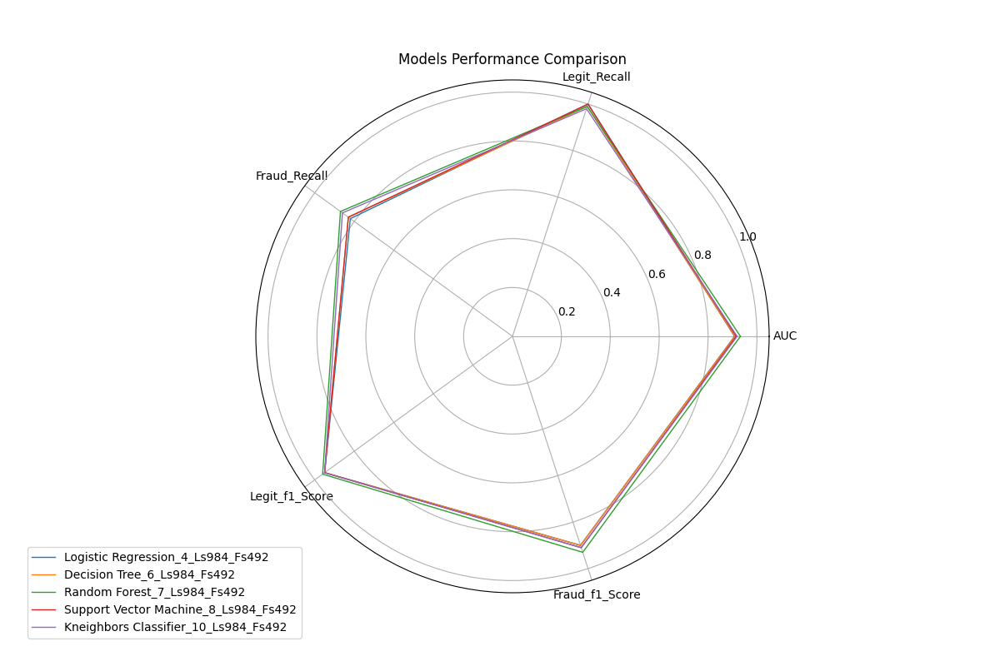

<style>
    NOTE: These css did not work
.max_val {
    background-color: #729FCF  /* Fade blue */ 
    }
    
.min_val {
    background-color: #B2B2B2  /* silver */ 
    color: green
    }
</style>

# Credit Card Fraud Detection


### 1. Introduction

According to globenewswire, in 2021, credit card fraud losses exceeded \\$32 billion and losses are expected to reach \\$397.4 billion over the next 10 years. Therefore, it is important for credit card companies to recognize fraudulent credit card transactions and build trust with their customers.
The main objective of this article is to develop a machine learning model that will identify fraudulent transactions. This task should be considered to be in the production stage and not complete to be directly be used in real situation as some aspects will be skipped due to time, computer power, etc. But, we’ll use different machine algorithms to train a classification model in order to identify fraudulent transactions. 


### 2. Data collection and preprocessing
    
For this case study, we will use a transaction dataset to build a model that predicts fraud based on certain characteristics. The data used in this paper is provided by kaggle and can be downloaded here after creating an account.

Here is a quick description of the dataset contents:
* Transactions made by credit cards European cardholders.
* Data collected over 2 days in September 2013
* A total of 284,807 transactions
* 492 frauds recorded (0.172%)
* It contains 31 columns and 28 columns resulting from a PCA transformation
* Free of missing data
More details can be found on the kaggle
    
### 3. Exploratory Data Analysis (EDA)
For a dataset with a large number of features, it is necessary to select and retain those with high potential in terms of predictive power or use dimension reduction techniques to reduce their number. But for credit card fraud detection, of the 30 features, 28 are already PCA results. The absence of the original features - for privacy reasons - used in their creation makes it difficult to identify what they correspond to.

We can still perform feature engineering to identify the features that distinguish fraudulent transactions from the legit ones, and boxplots can be useful for this purpose.

For that let’s look at two the boxplots of 2 different features bellow: Amount and V3.

__Figure 1__: Amonts Distribution per Class


The boxplots in the left plot, representing transaction amounts for both fraudulent and legitimate transactions, may appear to show little variation, but it is noticeable that most fraudulent transactions tend to be below a certain amount, i.e., less than \\$2500. However, these amounts are still considered as outliers when compared to the overall distribution of transaction amounts.

To further analyze this, the plot in the middle focuses only on transactions with amounts up to \\$250. While it is difficult to differentiate between legitimate and fraudulent transactions in this range, as their respective boxplots are almost identical, it can be helpful to identify any extreme outliers.

Another feature that shows promise in distinguishing between legitimate and fraudulent transactions is V3, derived from a principal component analysis. V3 assigns higher scores to legitimate transactions and lower scores to fraudulent ones (excluding outliers).


### 4. Feature Engineering
In total, there are 30 features and they’re all numerical. We can write a script to identify those with a high potential differentiation power based on a custom criteria. For instance, we can decide that a feature has that high potential if for its two boxplots B1 (legit) and B2 (fraud), the 1st quartile of B1 is greater than the 3rd quartile of B2, or the opposite (e.i the 1st quartile of B2 is greater than the 3rd quartile of B1). We can achieve this by write a simple script in Python (see code [here](https://github.com/bationoA/Fraudulent_Credit_Card_Transaction_Detection)). 

```Python
from typing import Union
def QQ_compare(data1: Union[list, pd.Series], data2: Union[list, pd.Series]):
    """
    This function check if the Q3 of data1 is < Q1 of data2
    OR
    if Q1 of data1 is > Q3 of data2
    """
    
    Q1_1, Q3_1 = list(np.percentile(data1, [25, 75]))
    Q1_2, Q3_2 = list(np.percentile(data2, [25, 75]))
    
    # if the Q3 of data1 est < Q1 of data2
    if Q3_1 < Q1_2:
        return True
    # if Q1 of data1 is > Q3 of data2
    if Q1_1 > Q3_2:
        return True
    
    return False
```


Next, we loop through all features while testing them

```Python
print("List of variables with an high potential in predicting fraudulant transactions")
rk = 0
list_cols_high_potential = []
for col in df.columns[0:-1]:
    tmp_df = df#[df["Amount"]<250]
    dt1 = tmp_df[tmp_df['Class']==0][col]
    dt2 = tmp_df[tmp_df['Class']==1][col]
    QQ_result = QQ_compare(data1=dt1, data2=dt2)
    
    if QQ_result:
        rk += 1
        print(f"{rk}: {col}")
        list_cols_high_potential.append(col)
    
list_cols_high_potential
```

Finally, plotting these features gives the Figure 2 bellow:

__Figure 2__: Features selection


We can notice that the variables selected by our script have a certain potential in discriminating fraudulent transactions from the legit ones. For the other variables we can try different transformations such as logarithm, square, trigonometric etc and rerun the previous script to check for new variables with high discrimination potential.
But we will just will try only the square transformation. This shows that by squaring all the remaining variables the index V_21 and V_27 (their squared values) was spotted by the script (see the below graph)

__Figure 3__: Features selection



### 5. Model Selection
There are several algorithms than can be used in our situation to train a classification model. Among there there.

* Logistic Regression:
* Support Vector Machines:
* Tree-based algorithms such as Decision Tree and Random Forest: These algorithms are known for their ability to handle imbalanced data better than others such as logistic regression or support vector machines.
* Deep Learning:
* Logistic regression, support vector machines, and decision trees are sensitive to outliers in the training data. Outliers can have a significant impact on the decision boundary, and hence on the classification results, especially for algorithms that rely on the distance between data points, such as SVM. In logistic regression and decision trees, outliers can affect the model coefficients and the splitting criteria, respectively, leading to biased or unstable models. Therefore, it is important to handle outliers appropriately before or during training to improve the performance and stability of these algorithms.
* Robust methods: Some machine learning algorithms, such as random forests and support vector machines, are naturally robust to outliers. Using these algorithms can be an effective way to handle outliers in the data.
* Ensemble methods: Ensemble methods like bagging and boosting can also help handle outliers by averaging or combining the predictions of multiple models. This can help reduce the impact of outliers on the overall performance of the model.

For this case study We’ll restrict our choice to Logistic Regression, Support Vector Machines, Decision Tree and Random Forest. The fact that the dataset is highly unbalanced makes the use of accuracy measure irrelevant. Therefore we will focus on measures such as Area under cover (AUC), precision, recall, and f1-score. 


### 6. Model training and evaluation
The quality of datasets and their distribution play an important role when its comes to training a model. This even more important when data dataset is highly imbalanced as the one we’re dealing with.  Even if there are training algorithms that can handle this such datasets there are still some common methods to address imbalanced data.  

* Resampling the data: This involves either undersampling the majority class or oversampling the minority class.
* Adjusting the classification threshold: By default, most classifiers have a threshold of 0.5 for classifying samples as positive or negative. Adjusting this threshold can help improve performance on the minority class
* Using different performance metrics: Accuracy is not always the best metric to evaluate the performance of a classification model on imbalanced data. Indeed the proportion of fraudulent transaction in our dataset is 0.172% which is less than 1%. A simple way to have a model with at least 99% of accuracy (which is pretty good for a balanced dataset), we can just decide flag all transaction as  legit in our predictions. This will take us away from our main objective which to help credits card companies to offer a more secure service to their clients by spotting fraudulent transactions. IMetrics such as precision, recall, F1 score, and AUC-ROC can be more informative.

__Table 1__ presents the performance results of the five different machine learning models trained to identify fraudulent transactions of credit cards. The evaluation metrics used to assess their performance include Accuracy, AUC, Precision, Recall, and f1 score for both legitimate and fraudulent transactions.

All the models achieved high accuracy levels ranging from 0.9345 to 0.9503. The Random Forest model achieved the highest accuracy of 0.9503, while the Decision Tree model achieved the lowest accuracy of 0.9323.

The AUC (Area Under Curve) values range from 0.9085 to 0.9324, and the Random Forest model has the highest AUC of 0.9324, indicating that this model can effectively distinguish between fraudulent and legitimate transactions.

In terms of precision, all models achieved a high precision for fraudulent transactions, with values ranging from 0.96 to 0.99, indicating that these models have a low false-positive rate. The Random Forest model achieved the highest precision score of 0.99. Both Logistic Regression and Support Vector Machine also achieved the same precision of 0.99.

The Recall metric measures the ability of the model to identify fraudulent transactions, and all models achieved high recall scores for both fraudulent and legitimate transactions, indicating that the models can detect a high percentage of fraudulent transactions. The Random Forest model achieved the highest recall score of 0.87 for fraudulent transactions.

The f1 score is the harmonic mean of precision and recall, and it provides a measure of the model's overall performance. All models achieved high f1 scores ranging from 0.90 to 0.93, with the Random Forest model achieving the highest f1 score of 0.93.

__Table 1__: Models Performance
<table style="width: 80%">
  <thead>
    <tr>
      <th>No</th>
      <th>Model Name</th>
      <th>Acc</th>
      <th>AUC</th>
      <th>Legit Precision</th>
      <th>Fraud Precision</th>
      <th>Legit Recall</th>
      <th>Fraud Recall</th>
      <th>Legit f1 Score</th>
      <th>Fraud f1 Score</th>
      <th>Legit Sample Size</th>
      <th>Fraud Sample Size</th>
      <th>Total Sample Size</th>
    </tr>
  </thead>
  <tbody>
    <tr>
      <td>4</td>
      <td>Logistic Regression</td>
      <td style="background-color: #B2B2B2">0.934</td>
      <td style="background-color: #B2B2B2">0.908</td>
      <td style="background-color: #B2B2B2">0.91</td>
      <td style="background-color: #729FCF">0.99</td>
      <td style="background-color: #729FCF">1.0</td>
      <td style="background-color: #B2B2B2">0.82</td>
      <td>0.95</td>
      <td>0.9</td>
      <td>984</td>
      <td>492</td>
      <td>1476</td>
    </tr>
    <tr>
      <td>6</td>
      <td>Decision Tree</td>
      <td>0.932</td>
      <td>0.909</td>
      <td>0.92</td>
      <td>0.97</td>
      <td>0.99</td>
      <td>0.83</td>
      <td>0.95</td>
      <td>0.9</td>
      <td>984</td>
      <td>492</td>
      <td>1476</td>
    </tr>
    <tr>
      <td>7</td>
      <td>Random Forest</td>
      <td style="background-color: #729FCF">0.950</td>
      <td style="background-color: #729FCF">0.932</td>
      <td style="background-color: #729FCF">0.93</td>
      <td style="background-color: #729FCF">0.99</td>
      <td>0.99</td>
      <td style="background-color: #729FCF">0.87</td>
      <td style="background-color: #729FCF">0.96</td>
      <td style="background-color: #729FCF">0.93</td>
      <td>984</td>
      <td>492</td>
      <td>1476</td>
    </tr>
    <tr>
      <td>8</td>
      <td>Support Vector Machine</td>
      <td>0.939</td>
      <td>0.914</td>
      <td>0.92</td>
      <td style="background-color: #729FCF">0.99</td>
      <td style="background-color: #729FCF">1.0</td>
      <td>0.83</td>
      <td>0.95</td>
      <td>0.91</td>
      <td>984</td>
      <td>492</td>
      <td>1476</td>
    </tr>
    <tr>
        <td>10</td>
        <td>Kneighbors Classifier</td>
        <td>0.936</td>
        <td>0.919</td>
        <td>0.93</td>
        <td style="background-color: #B2B2B2">0.96</td>
        <td style="background-color: #B2B2B2">0.98</td>
        <td>0.86</td>
        <td>0.95</td>
        <td>0.91</td>
        <td>984</td>
        <td>492</td>
        <td>1476</td>
    </tr>
  </tbody>
</table>


__Figure 3__: Models Performance Comparison



### 7. Conclusion
Overall, the Random Forest model appears to be the best-performing model based on the high values of AUC, precision, recall, and f1 score. However, all models performed well and achieved high accuracy levels, indicating that they can effectively identify fraudulent transactions.

In practical terms, what does the performance of Random Forest model means?

 1. For every 100 transactions flagged by the model, only 1 would not potentially be a fradulent transaction
 2. But for every 100 transactions considered as legit by the model, 7 of them could actually be fradulents transactions
 3. For every 100 fradulent transactions given to the model, 87 of them will potentially be correctely identified as such
 4. While for every 100 legit transactions given to the model, only 1 will potentially be flagged as fraudulent by the model
 
In cases where there is no a model standing out from the rest as here, the fimal decision of using one model over the others will depends on factors such as:
* The cost for the customers and the company if legit transactions are miss-falgged as fradulent
* The cost for the customers and the company if fradulent transactions are not falgged as fradulent
* The computation cost to deploy the moodel

### 8. Future work to improve the model
Many factors, even if mentionned previously, have not been takken into account while trainin the model. Other parameters tunning and algorithms are also available to test. Few things that could be done are:

* Synthetic Minority Oversampling Technique (SMOTE): It is a method to address class imbalance problems in machine learning. SMOTE technique generates synthetic samples for the minority class (here fradulent transactions) by interpolating between the existing samples, thus increasing the representation of the minority class in the dataset. Even if it is not guaranteed, it has been shown to improve the performance of many classifiers
* Remove or transform outliers and retrain models that are sensitive to outliers
* Consider using Neural Network too

